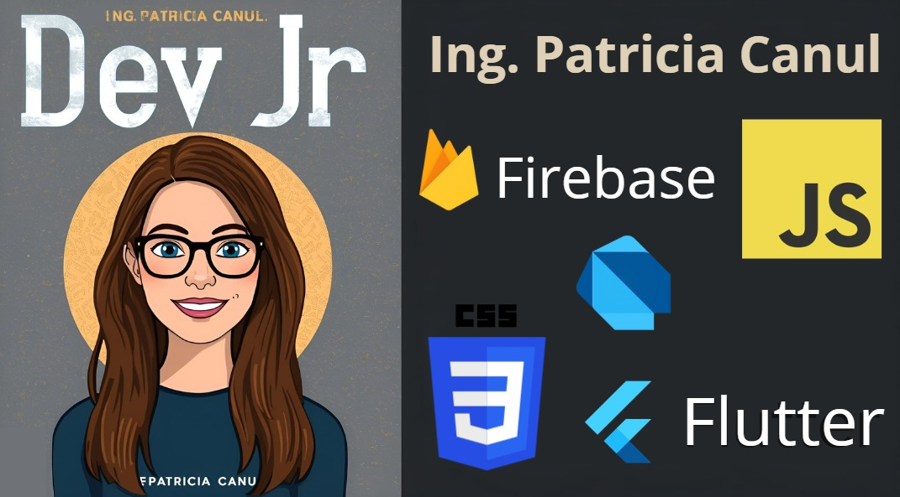

  <!-- Línea 1 -->
  
  
  <!-- Línea 2 -->
  

---

## 👩🏻‍💻 Sobre mí  

<picture> 
  
</picture>

- 👩🏻‍💻 Actualmente trabajando con mis propios proyectos y en una empresa como Dev Jr.  
- 📖 Aprendiendo  &  usando el patrón de diseño MVC  
- 💡 Comenzando a desarrollar en Flutter  
- 💬 Conocimiento en       
- 📫 Contacto: patty.canul@outlook.com | patty.canul98@gmail.com  
- ⚡ Dato Curioso: *"Jamás creí que podría aprender a programar… ¡y aquí estoy, intentando crear proyectos increíbles!"* ✨ 

---

## 🛠️ Tecnologías y Herramientas  

### 💻 Backend
  
  
  
  

### 🌐 Frontend  
  
  
  
  

### 📱 Mobile  
  
  

### 🛢️ Bases de Datos  
  
  
  

### ⚙️ Herramientas  
  
  
  
  
  

---

## 🚀 Proyectos Destacados  

- 📱 **App móvil básica en Flutter** (Aplicación de Fisioterapia)  
- 📊 **CRUD de empleados** con React + Node.js + MySQL  
- 🏢 **Sistema web MVC** en .NET + C# para gestión de usuarios  

---

## 📖 Actualmente Aprendiendo  

- Arquitectura **Clean Code** en Flutter  
- Patrones de diseño en **.NET Framework MVC**  
- Buenas prácticas en **JavaScript**  
- Lenguaje de programación **C#**  

---

## 🗺️ Próximos Proyectos / Roadmap  

- [ ] Crear una **app de gestión de tareas en Flutter**  
- [ ] Desarrollar un **sistema de inventario con .NET y SQL Server**  
- [ ] Conectar **APIs REST** a proyectos personales  
- [ ] Publicar mi **primer proyecto en Play Store**  

---

## 🌱 Soft Skills  

- 🤝 Trabajo en equipo  
- 💬 Comunicación efectiva  
- 🧩 Resolución de problemas  
- 🚀 Aprendizaje continuo  

---

## 🎨 Hobbies / Intereses  

- 🎶 Escuchar música mientras programo.
- ☕ Amante del café y las charlas de tecnología.
- 📚 Siempre aprendiendo algo nuevo.
- 🎮 Me encanta jugar videojuegos.

---

## 📫 Contacto  

✉️ **patty.canul@outlook.com** | **patty.canul98@gmail.com**  
💼 [LinkedIn](https://www.linkedin.com/in/patricia-canul-canul-7964521a1/)  
 
---

  

  
<strong>Patricia Canul</strong> – Desarrolladora Jr. me encanta Flutter, aprendiendo .NET Framework 

  

    
    
    
    
    
  

  
<em>¿Te interesa colaborar o compartir ideas?  
  ¡Estoy abierta a nuevas oportunidades y conexiones!</em>

